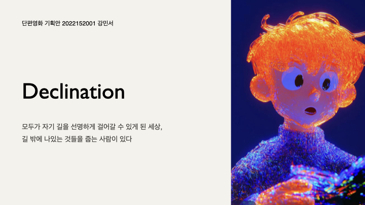
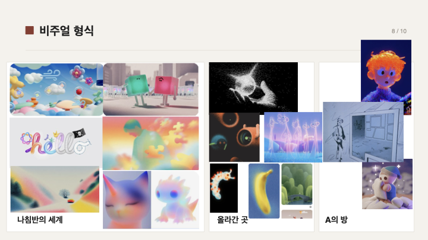

# Declination

> 모두가 자기 길을 선명하게 걸어갈 수 있게 된 세상,
> 길 밖에 나있는 것들을 줍는 사람이 있다.

단편영화 기획안 · 2022152001 강민서

---

## 로그라인

모두가 자기 길을 선명하게 걸어갈 수 있게 된 시대.
홀로 길 가장자리에 남은 것들을 줍는 사람이 있다.
그 사람은 자신과 같은 눈을 가진 누군가를 찾아 아주 먼 곳까지 떠나간다.
그곳에서 처음으로 이해받지만, 찾고 있던 존재는 없었다.
그가 돌아오는 길, 처음으로 그 사람 말고도 다른 것들을 줍는 사람들이 있다는 것을 발견하게 된다.

---

## 시놉시스

AI가 사람들의 나침반을 교정해주는 세계. 교정이 마찰을 줄이고 오차를 정리한다.
사람들은 자기 방향을 빠르게 잡는다. 안정적이고, 깔끔하고, 의심이 없는 걸음. 이 세계는 잘못 돌아가지 않는다.

A도 같은 나침반으로 거리를 걷지만 시선이 자꾸 바깥으로 향한다. 결론을 내지 못한 생각, 이름을 붙이지 못한 감정, 끝까지 보지 못한 풍경처럼 그닥 쓸모없어 보이는 것들을 줍는다. 방으로 가져와 펼치고, 자르고, 붙이고, 잇는다. A는 무언가를 만든다.

어느 날 A는 모은 것 하나를 오래 들여다본다. 자기에게만 보였다고 생각한 것들 속에, 다른 누군가의 시선과 지나간 흔적이 보인다.
A와 같은 눈을 가진 사람이 어디엔가 분명 있다는 걸 직감하고, 먼 길을 갈 가방을 챙긴다.

머나먼 곳에서, A를 이해하고, 의미가 통하는 존재들을 만난다. 그러나 그들이 A와 같은 눈을 가진 것은 아니었다.
시간이 지나도 A의 옆자리는 비어 있다. A의 곁에 머물 사람은 없었다.

A는 그 자리를 떠난다. 돌아오는 길에서 처음으로 길 밖의 것을 줍는 다른 외톨이 수집가들을 보게 된다.
한 사람은 혼자 집에 돌아가는 버스 창밖을 오래오래 보고 싶어 풍경을 손가락으로 길게 눌러 저장한다.
한 사람은 혼자 지반 지층의 단면을 케이크처럼 떼어내 가방에 넣는다. 각자 혼자서, 각자 다른 것을 모은다.

A는 그중 한 사람에게 다가가 자기가 모은 것을 맞춰본다. 두 개는 생각보다 어색하고, 맞지 않는다.
둘이 그걸 보고 잠깐 웃는다. 허무하고 웃기고 아쉽지만 시원한 웃음.

다음 날 A의 책상에 자기 것과 받은 것 하나가 같이 놓인다. 한참 들여다본 뒤 손이 다시 움직인다.

---

## 세계관

### AI가 사람들의 나침반을 보정해주는 편리하고 유용한 세계

AI 덕분에 발달한 나침반 보정(Calibration)은 각자 살아가는 길에서 맞이하는 실수, 미련, 아쉬움, 갈팡질팡 등의 마찰을 줄이고 오차를 정리해준다.
사람들은 이제 삶의 방향을 더 빠르게 잡고, 더 나은 길을 향해 간다.
이 세계는 나쁜 게 아니라 사람들이 합의한 효율의 결과다.

다만 그곳에는, 보정 속에서 잃어버리는 부산물이 있다.
이것들은 틀리거나 불필요한 것들이 아니다. 단지 더 중요한 게 있기 때문에 누구도 충분히 시선을 두지 못한 채 그 자리에 남겨져 있는 것들이다.

---

## 인물

### A — 길 밖의 것들을 모으는 사람

결론을 내지 못한 생각, 이름을 붙이지 못한 감정, 끝까지 보지 못한 풍경처럼 그닥 쓸모 있지 않지만 의미 있다고 생각하는 것들을 줍는다.
그것들을 방으로 가져와 종이 위에서 자르고 붙이고 잇는다. 자기 시선이 다른 곳을 향한다는 사실을 안다.
같은 것을 보는 사람을 만난 적이 없고, 그래서 외롭다.

### 다른 수집가들

각자 다른 영역에서 다른 눈으로 다른 것을 모으는 사람들. 한 사람은 버스 창밖 풍경을 손가락으로 길게 눌러 저장한다. 한 사람은 지층의 단면을 케이크처럼 떼어내 가방에 넣는다. 이들의 수집은 A가 모으는 부산물이 아니다. 각자의 영역에서 다른 의미를 가진 것들이다.
A는 머나먼 곳을 떠나 돌아오는 길에서 처음으로 이들을 발견한다.

---

## 이야기 구조

| # | 장소 | 내용 |
|---|------|------|
| S#1 | 거리 | A가 나침반을 따라 가는 사람들 사이를 가로지르며 가장자리의 것들을 줍는다. |
| S#2 | A의 방 | 종이 위에서 자르고 붙이고 잇는다. 작업을 끝맺지 않고 한쪽에 둔다. |
| S#3 | 거리 | 같은 눈을 가진 사람이 어디엔가 있다고 판단하고, 먼 길을 떠날 가방을 챙긴다. |
| S#4 | 먼 곳 | 도착한 그곳에서 자기를 알아보는 사람들을 만난다. 옆자리는 비어 있다. |
| S#5 | 돌아오는 길 | 그 자리를 스스로 떠난다. 그 길에서 내가 아닌 다른 수집가들을 처음 본다. |
| S#6 | 접촉 | 한 사람에게 다가가 A가 모은 것을 맞춰본다. 두 수집은 엉성하게 맞지 않는다. 둘이 짧게 웃는다. |
| S#7 | A의 방 | 한 사람에게 받은 것 하나가 자기 것 옆에 놓인다. 손이 다시 움직인다. |

---

## 비주얼 형식

---

## 원본 파일

- 키노트 원본: [`단편영화_기획안_수집가들_초고.key`](단편영화_기획안_수집가들_초고.key)
- 전체 슬라이드 이미지: [`assets/slides/`](assets/slides/)
